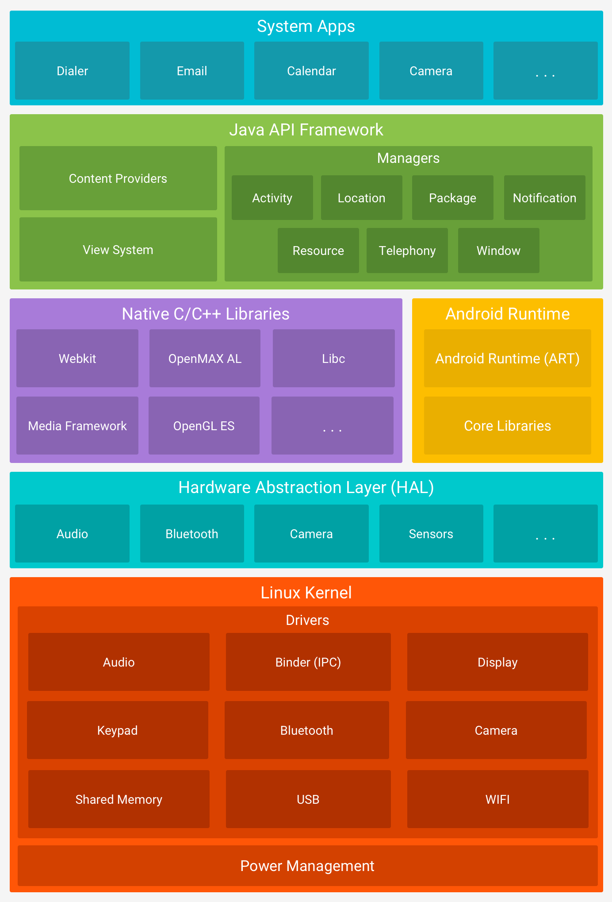
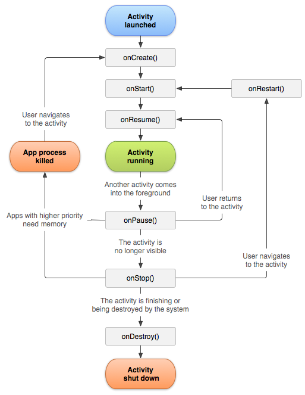
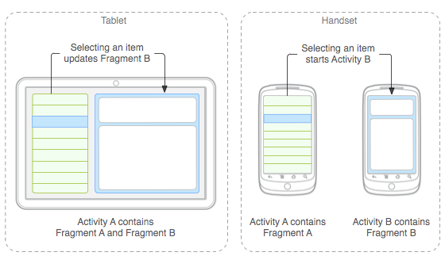
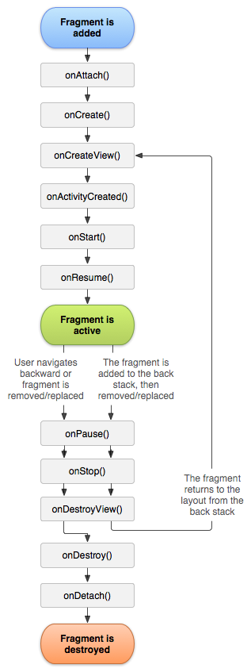

#History

## J2ME

  - Java 2 Platform, Micro Edition
  - A java platform designed for mobile development and personal assitants (PDAs)
  - Used Java K Virtual Machine
##Blackberry Mobile

  - Smartphones designed by Research in Motion 
  - Very succesful at launch
  - Business oriented
  - Secure
##Android

  - Founded by Andy Rubin in Palo Alto, California
  - Acquired by Google in 2005
  - Originally intended for camera, later shifted to mobile
  - Currently over 2 billion monthly active users
##Windows Mobile

  - Mobile OS by Microsoft
  - Initially called PocketPC 2000
  - Replaced by Windows phone
  - Now deprecated

---

#Android Platform

- Android is an open source, Linux-based software stack created for a wide array of devices and form factors. 

- Android provides a rich application framework that allows you to build innovative apps and games for mobile devices in a Java language environment. 

- Founded by Andy Rubin in Palo Alto, California

- Acquired by Google in 2005

- Originally intended for camera, later shifted to mobile

- Currently over 2 billion monthly active users

##Architecture

- 

##Components

- Android applications are built using reusable components
- They Are:
  - Activities
  - Services 
  - Content Provider
  - Broadcast Reciever

---

#Android Tools

##SDK

  - The Android SDK (software development kit) is a set of development tools used to develop applications for Android platform. The Android SDK includes the following:
    - Required libraries
    - Debugger
    - An emulator
    - Relevant documentation for the Android application program interfaces (APIs)
    - Sample source code
    - Tutorials for the Android OS
  - Every time Google releases a new version of Android, a corresponding SDK is also released. 
  - To be able to write programs with the latest features, developers must download and install each version's SDK for the particular phone. 
  - The development platforms that are compatible with SDK include operating systems like Windows (XP or later), Linux (any recent Linux distribution) and Mac OS X (10.4.9 or later). The components of Android SDK can be downloaded separately. 
##ADB:

  - Android Debug Bridge (adb) is a versatile command-line tool that lets you communicate with a device. 
  - The adb command facilitates a variety of device actions, such as installing and debugging apps, and it provides access to a Unix shell that you can use to run a variety of commands on a device. 
  - It is a client-server program that includes three components:
    - **A client**, which sends commands. The client runs on your development machine. You can invoke a client from a command-line terminal by issuing an adb command.
    - **A daemon (adbd)**, which runs commands on a device. The daemon runs as a background process on each device.
    - **A server**, which manages communication between the client and the daemon. The server runs as a background process on your development machine.
##Gradle:

  - Gradle is a build system used to build Android applications. 
  - The build system automatically takes all the source files (`.java` or `.xml`), then applies the appropriate tool (e.g. takes `java` class files and converts them to `dex` files), and groups all of them into one compressed file, our beloved APK.
  - Gradle is a **build system** that takes the best features from other build systems and combines them into one. 
  - A project using Gradle describes its build via a *build.gradle* file. 
  - This file is located in the root folder of the project.
  - The Gradle build system uses plug-ins to extend its core functionality. 
  - A plug-in is an extension to Gradle which typically adds some preconfigured tasks. 
  - Gradle ships with a number of plug-ins, and you can develop custom plug-ins.

---

#Activities and Lifecycle, Fragments and Intents

##Activities

  - Activities are one of the fundamental building blocks of apps on the Android platform. They serve as the entry point for a user's interaction with an app, and are also central to how a user navigates within an app (as with the Back button) or between apps (as with the Recents button).

    Skillfully managing activities allows you to ensure that, for example:

    - Orientation changes take place smoothly without disrupting the user experience.
    - User data is not lost during activity transitions.
    - The system kills processes when it's appropriate to do so.

  - For your app to be able to use activities, you must declare the activities, and certain of their attributes, in the manifest:

    - ```xml
      <manifest ... >
        <application ... >
            <activity android:name=".ExampleActivity" />
            ...
        </application ... >
        ...
      </manifest >

      ```

  - ###Life Cycle:

    

    - **onCreate()**

      - You must implement this callback, which fires when the system first creates the activity. 
      - On activity creation, the activity enters the *Created* state. 
      - In the `onCreate()` method, you perform basic application startup logic that should happen only once for the entire life of the activity.
    - **onStart()**

      - When the activity enters the Started state, the system invokes this callback. 
      - The `onStart()` call makes the activity visible to the user, as the app prepares for the activity to enter the foreground and become interactive. 
      - For example, this method is where the app initializes the code that maintains the UI. 
    - **onResume()**
      - When the activity enters the Resumed state, it comes to the foreground, and then the system invokes the `onResume()` callback. 
      - This is the state in which the app interacts with the user. 
      - The app stays in this state until something happens to take focus away from the app. 
      - Such an event might be, for instance, receiving a phone call, the user�s navigating to another activity, or the device screen�s turning off.
      - When an interruptive event occurs, the activity enters the *Paused* state, and the system invokes the `onPause()` callback.
    - **onPause()**
      - The system calls this method as the first indication that the user is leaving your activity (though it does not always mean the activity is being destroyed). 
      - Use the `onPause()` method to pause operations such animations and music playback that should not continue while the `Activity` is in the Paused state, and that you expect to resume shortly. 
      - There are several reasons why an activity may enter this state. For example:
        - Some event interrupts app execution. This is the most common case.
        - In Android 7.0 (API level 24) or higher, multiple apps run in multi-window mode. Because only one of the apps (windows) has focus at any time, the system pauses all of the other apps.
        - A new, semi-transparent activity (such as a dialog) opens. As long as the activity is still partially visible but not in focus, it remains paused.
    - **onStop()**
      - When your activity is no longer visible to the user, it has entered the *Stopped* state, and the system invokes the `onStop()` callback. 
      - This may occur, for example, when a newly launched activity covers the entire screen. 
      - The system may also call `onStop()` when the activity has finished running, and is about to be terminated.
    - **onDestroy()**
      - Called before the activity is destroyed. 
      - This is the final call that the activity receives. 
      - The system either invokes this callback because the activity is finishing due to someone's calling `finish()`, or because the system is temporarily destroying the process containing the activity to save space. 


---

#Styles and Themes

- A *style* is a collection of attributes that specify the look and format for a `View` or window. 

- A style can specify attributes such as height, padding, font color, font size, background color, and much more. 

- A style is defined in an XML resource that is separate from the XML that specifies the layout.

- To create a set of styles, save an XML file in the `res/values/` directory of your project. 

- The XML file must 

  - use the `.xml` extension
  - use lowercase, underscores, 
  - be saved in the `res/values/` folder.

- Eg:

  ```xml
  <resources>
      <style name="AppTheme" parent="Theme.Material">
          <item name="colorPrimary">#673AB7</item>
          <item name="colorPrimaryDark">#512DA8</item>
          <item name="colorAccent">#FF4081</item>
      </style>
  </resources>
  ```

- Depending on the attribute, you can use values with the following resource types in an `<item>` element:

  - Fraction
  - Float
  - Boolean
  - Color
  - String
  - Dimension
  - Integer

- The `parent` attribute in the `<style>` element lets you specify a style from which your style should inherit attributes. 

- You can use this to inherit attributes from an existing style and define only the attributes that you want to change or add.

- ## There are several ways to set a style

  - ### Apply a style to a view

    - ```xml
      <TextView
          style="@style/CodeFont"
          android:text="@string/hello" />
      ```

  - ### Apply a theme to an activity or app

    - To set a theme for all the activities of your app, open the `AndroidManifest.xml` file and edit the `<application>` tag to include the `android:theme`attribute with the style name. 

    - For example:

    - ```xml
      <application android:theme="@style/CustomTheme">
      ```

---

# Dialogs

- A dialog is a small window that prompts the user to make a decision or enter additional information. 

- A dialog does not fill the screen and is normally used for modal events that require users to take an action before they can proceed.

- Use DialogBuilder to create basic Dialogs:

- ```java
  AlertDialog dialog = new AlertDialog.Builder(MainActivity.this).create();

  dialog.setTitle("Title");
  dialog.setMessage("Message");

  //ADD A POSITIVE BUTTON
  dialog.setButton(dialog.BUTTON_POSITIVE, "YES", new DialogInterface.OnClickListener() {                       @Override
    public void onClick(DialogInterface dialog, int i) {
      //		POSITIVE BUTTON ACTION

  	}
  });

  //ADD A NEGATIVE BUTTON
  dialog.setButton(dialog.BUTTON_POSITIVE, "NO", new DialogInterface.OnClickListener() {                       @Override
    public void onClick(DialogInterface dialog, int i) {
      //		NEGATIVE BUTTON ACTION

  	}
  });

  //SHOW THE DIALOG
  dialog.show();
  ```

---

# Intents

- An `Intent` is a messaging object you can use to request an action from another app component. 

- Although intents facilitate communication between components in several ways, there are three fundamental use cases:

  - Starting an activity
    - An `Activity` represents a single screen in an app. 
    - You can start a new instance of an `Activity` by passing an `Intent` to `startActivity()`. 
    - The `Intent` describes the activity to start and carries any necessary data.
  - Starting a service
    - A `Service` is a component that performs operations in the background without a user interface. 
  - Delivering a broadcast
    - A broadcast is a message that any app can receive. 
    - The system delivers various broadcasts for system events, such as when the system boots up or the device starts charging. 
    - You can deliver a broadcast to other apps by passing an `Intent` to `sendBroadcast()` or `sendOrderedBroadcast()`.

##Types of Intents:

  - **Explicit intents**: 
    - Specify the component to start by name (the fully-qualified class name). 
    - You'll typically use an explicit intent to start a component in your own app, because you know the class name of the activity or service you want to start.
  - **Implicit intents** 
    - Do not name a specific component, but instead declare a general action to perform, which allows a component from another app to handle it. 
    - For example, if you want to show the user a location on a map, you can use an implicit intent to request that another capable app show a specified location on a map.

- An `Intent` object carries information that the Android system uses to determine which component to start, plus information that the recipient component uses in order to properly perform the action.

- The primary information contained in an `Intent` is the following:

  - **Component name**

    This is optional, but it's the critical piece of information that makes an intent *explicit*, meaning that the intent should be delivered only to the app component defined by the component name. 

    Without a component name, the intent is *implicit* and the system decides which component should receive the intent based on the other intent information.

  - **Action**

    A string that specifies the generic action to perform (such as *view* or *pick*).

  - **Data**

    The URI (a `Uri` object) that references the data to be acted on and/or the MIME type of that data.

  - **Extras**

    Key-value pairs that carry additional information required to accomplish the requested action. 

    You can add extra data with various `putExtra()` methods, each accepting two parameters: the key name and the value. 

- **Example Explicit Intent**

  ```java
  Intent intent = new Intent(this, SecondActivity.class);
  startActivity(intent);
  ```

- **Example Implicit Intent**

  ```java
  Intent sendIntent = new Intent();

  sendIntent.setAction(Intent.ACTION_SEND);
  sendIntent.putExtra(Intent.EXTRA_TEXT, textMessage);
  sendIntent.setType("text/plain");

  startActivity(sendIntent);

  ```

- Recieving an Implicit Intent:

  - To advertise which implicit intents your app can receive, declare one or more intent filters for each of your app components with an `<intent-filter>` element in your manifest file.

  - For example, here's an activity declaration with an intent filter to receive an `ACTION_SEND` intent when the data type is text:

    ```xml
    <activity android:name="ShareActivity">
        <intent-filter>
            <action android:name="android.intent.action.SEND"/>
            <category android:name="android.intent.category.DEFAULT"/>
            <data android:mimeType="text/plain"/>
        </intent-filter>
    </activity>
    ```


---

# Fragments

- A `Fragment` represents a behavior or a portion of user interface in an `Activity`. 
- You can combine multiple fragments in a single activity to build a multi-pane UI and reuse a fragment in multiple activities. 
- You can think of a fragment as a modular section of an activity, which has its own lifecycle, receives its own input events, and which you can add or remove while the activity is running (sort of like a "sub activity" that you can reuse in different activities).



## Life-Cycle of a Fragment:





