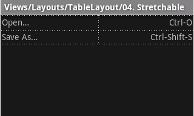
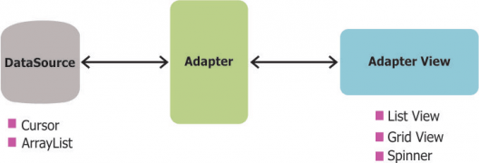

# UI Design

## Views and Viewgroups

- All user interface elements in an Android app are built using `View` and `ViewGroup` objects. 

- A `View` is an object that draws something on the screen that the user can interact with. 

- A `ViewGroup` is an object that holds other `View` (and `ViewGroup`) objects in order to define the layout of the interface.

- The user interface for each component of your app is defined using a hierarchy of `View` and `ViewGroup` objects, as shown in the figure:

  


- Eg:

  ```xml
  <?xml version="1.0" encoding="utf-8"?>
  <LinearLayout xmlns:android="http://schemas.android.com/apk/res/android"
                android:layout_width="fill_parent"
                android:layout_height="fill_parent"
                android:orientation="vertical" >
      <TextView android:id="@+id/text"
                android:layout_width="wrap_content"
                android:layout_height="wrap_content"
                android:text="I am a TextView" />
      <Button android:id="@+id/button"
              android:layout_width="wrap_content"
              android:layout_height="wrap_content"
              android:text="I am a Button" />
  </LinearLayout>
  ```


## Action Bar

The *action bar* is a dedicated piece of real estate at the top of each screen that is generally persistent throughout the app.

**It provides several key functions**:

- Makes important actions prominent and accessible in a predictable way (such as *New* or *Search*).
- Supports consistent navigation and view switching within apps.
- Reduces clutter by providing an action overflow for rarely used actions.
- Provides a dedicated space for giving your app an identity.

The action bar is split into four different functional areas that apply to most apps:


1. **App Icon:** 
   - The app icon establishes your app's identity. 
   - It can be replaced with a different logo or branding if you wish. 
2. **View Control:**
   - If your app displays data in different views, this segment of the action bar allows users to switch views. 
   - Examples of view-switching controls are drop-down menus or tab controls. 
3. **Action Buttons:**
   - Show the most important actions of your app in the actions section. 
   - Actions that don't fit in the action bar are moved automatically to the action overflow. 
4. **Action Overflow:**
   - Move less often used actions to the action overflow.

**Contextual Action Bars:**

- A *contextual action bar (CAB)* is a temporary action bar that overlays the app's action bar for the duration of a particular sub-task. 

- CABs are most typically used for tasks that involve acting on selected data or text.

  

- The selection CAB appears after a long press on a selectable data item triggers selection mode.

  **From here the user can**:

  - Select additional elements by touching them.
  - Trigger an action from the CAB that applies to all selected data items. The CAB then automatically dismisses itself.
  - Dismiss the CAB via the navigation bar's Back button or the CAB's checkmark button. This removes the CAB along with all selection highlights.

- Use CABs whenever you allow the user to select data via long press. 

- You can control the action content of a CAB in order to insert the actions you would like the user to be able to perform.

---

## Navigation Drawers

- The navigation drawer is a panel that displays the app’s main navigation options on the left edge of the screen. 

- It is hidden most of the time, but is revealed when 

  1. the user swipes a finger from the left edge of the screen 

     ​	or, 

  2. while at the top level of the app, the user touches the app icon in the action bar.

- To add a navigation drawer, declare your user interface with a `DrawerLayout` object as the root view of your layout. 

  ```xml
  <android.support.v4.widget.DrawerLayout
      xmlns:android="http://schemas.android.com/apk/res/android"
      android:id="@+id/drawer_layout"
      android:layout_width="match_parent"
      android:layout_height="match_parent">
     
  </android.support.v4.widget.DrawerLayout>
  ```

  ​

- Inside the `DrawerLayout`, add one view that contains the main content for the screen (your primary layout when the drawer is hidden).

  ```xml
  <android.support.v4.widget.DrawerLayout
      xmlns:android="http://schemas.android.com/apk/res/android"
      android:id="@+id/drawer_layout"
      android:layout_width="match_parent"
      android:layout_height="match_parent">
    
      <!-- The main content view -->
      <FrameLayout
          android:id="@+id/content_frame"
          android:layout_width="match_parent"
          android:layout_height="match_parent" />
      
  </android.support.v4.widget.DrawerLayout>
  ```

  ​

-  And another view that contains the contents of the navigation drawer.

  ```xml
  <android.support.v4.widget.DrawerLayout
      xmlns:android="http://schemas.android.com/apk/res/android"
      android:id="@+id/drawer_layout"
      android:layout_width="match_parent"
      android:layout_height="match_parent">
    
      <!-- The main content view -->
      <FrameLayout
          android:id="@+id/content_frame"
          android:layout_width="match_parent"
          android:layout_height="match_parent" />
    
      <!-- The navigation drawer -->
      <android.support.design.widget.NavigationView
           android:id="@+id/navigation"
           android:layout_width="wrap_content"
           android:layout_height="match_parent"
           android:layout_gravity="start"
           app:menu="@menu/my_navigation_items" />
  </android.support.v4.widget.DrawerLayout>
  ```

- The items in the DrawerLayout are populated as per the use case of the app.

- The DrawerLayout must consist of a ListView

- This ListView is set up programmatically in the activity's corresponding `java` file.

- When the user selects an item in the drawer's list, the system calls `onItemClick()` on the `OnItemClickListener` given to `setOnItemClickListener()`.


---


## Layouts/Layout Managers

A layout defines the visual structure for a user interface, such as the UI for an [activity](https://developer.android.com/guide/components/activities.html) or [app widget](https://developer.android.com/guide/topics/appwidgets/index.html). You can declare a layout in two ways:

- **Declare UI elements in XML**. Android provides a straightforward XML vocabulary that corresponds to the View classes and subclasses, such as those for widgets and layouts.
- **Instantiate layout elements at runtime**. Your application can create View and ViewGroup objects (and manipulate their properties) programmatically.

Using Android's XML vocabulary, you can quickly design UI layouts and the screen elements they contain, in the same way you create web pages in HTML — with a series of nested elements:

```xml
<?xml version="1.0" encoding="utf-8"?>
<LinearLayout xmlns:android="http://schemas.android.com/apk/res/android"
              android:layout_width="match_parent"
              android:layout_height="match_parent"
              android:orientation="vertical" >
    <TextView android:id="@+id/text"
              android:layout_width="wrap_content"
              android:layout_height="wrap_content"
              android:text="Hello, I am a TextView" />
    <Button android:id="@+id/button"
            android:layout_width="wrap_content"
            android:layout_height="wrap_content"
            android:text="Hello, I am a Button" />
</LinearLayout>
```

Some common Layouts are:

### LinearLayout

- `LinearLayout` is a view group that aligns all children in a single direction, vertically or horizontally. 

- You can specify the layout direction with the [`android:orientation`](https://developer.android.com/reference/android/widget/LinearLayout.html#attr_android:orientation) attribute.

- All children of a `LinearLayout` are stacked one after the other, so a vertical list will only have 

  - one child per row, no matter how wide they are, 

    ​	and 

  - a horizontal list will only be one row high (the height of the tallest child, plus padding). 

- A `LinearLayout` respects *margin*s between children and the *gravity* (right, center, or left alignment) of each child.

- **Layout Weight:**

  - `LinearLayout` also supports assigning a *weight* to individual children with the [`android:layout_weight`](https://developer.android.com/reference/android/widget/LinearLayout.LayoutParams.html#attr_android:layout_weight) attribute. 
  - This attribute assigns an "importance" value to a view in terms of how much space it should occupy on the screen. 
  - A larger weight value allows it to expand to fill any remaining space in the parent view. 
  - Child views can specify a weight value, and then any remaining space in the view group is assigned to children in the proportion of their declared weight. 
  - *Default weight is zero.*

- **Eg:**

  ```xml
  <?xml version="1.0" encoding="utf-8"?>
  <LinearLayout xmlns:android="http://schemas.android.com/apk/res/android"
      android:layout_width="match_parent"
      android:layout_height="match_parent"
      android:paddingLeft="16dp"
      android:paddingRight="16dp"
      android:orientation="vertical" >
      <EditText
          android:layout_width="match_parent"
          android:layout_height="wrap_content"
          android:hint="@string/to" />
      <EditText
          android:layout_width="match_parent"
          android:layout_height="wrap_content"
          android:hint="@string/subject" />
      <EditText
          android:layout_width="match_parent"
          android:layout_height="0dp"
          android:layout_weight="1"
          android:gravity="top"
          android:hint="@string/message" />
      <Button
          android:layout_width="100dp"
          android:layout_height="wrap_content"
          android:layout_gravity="right"
          android:text="@string/send" />
  </LinearLayout>
  ```

### RelativeLayout

- `RelativeLayout` is a view group that displays child views in relative positions. 

- The position of each view can be specified as 

  - relative to sibling elements (such as to the left-of or below another view) 

    ​	or 

  - in positions relative to the parent `RelativeLayout` area (such as aligned to the bottom, left or center).

- `RelativeLayout` lets child views specify their position relative to the parent view or to each other (specified by ID). 

- So you can 

  - align two elements by right border, 
  - make one below another, 
  - centered in the screen, 
  - centered left, 
  - and so on. 

- By default, all child views are drawn at the top-left of the layout, so you must define the position of each view using the various layout properties available from `RelativeLayout.LayoutParams`.

- **Eg:**

  ```xml
  <?xml version="1.0" encoding="utf-8"?>
  <RelativeLayout xmlns:android="http://schemas.android.com/apk/res/android"
      android:layout_width="match_parent"
      android:layout_height="match_parent"
      android:paddingLeft="16dp"
      android:paddingRight="16dp" >
      <EditText
          android:id="@+id/name"
          android:layout_width="match_parent"
          android:layout_height="wrap_content"
          android:hint="@string/reminder" />
      <Spinner
          android:id="@+id/dates"
          android:layout_width="0dp"
          android:layout_height="wrap_content"
          android:layout_below="@id/name"
          android:layout_alignParentLeft="true"
          android:layout_toLeftOf="@+id/times" />
      <Spinner
          android:id="@id/times"
          android:layout_width="96dp"
          android:layout_height="wrap_content"
          android:layout_below="@id/name"
          android:layout_alignParentRight="true" />
      <Button
          android:layout_width="96dp"
          android:layout_height="wrap_content"
          android:layout_below="@id/times"
          android:layout_alignParentRight="true"
          android:text="@string/done" />
  </RelativeLayout>
  ```


### TableLayout

- `TableLayout` is a `ViewGroup` that displays child `View` elements in rows and columns.

- `TableLayout` positions its children into rows and columns. 

- TableLayout containers do not display border lines for their rows, columns, or cells. 

- The table will have as many columns as the row with the most cells. 

- A table can leave cells empty. 

- Cells can span multiple columns, as they can in HTML. 

- You can span columns by using the `span` field.

- `TableRow` objects are the child views of a TableLayout (each TableRow defines a single row in the table). 

- Each row has zero or more cells, each of which is defined by any kind of other View.

- The following sample layout has two rows and two cells in each. The accompanying screenshot shows the result, with cell borders displayed as dotted lines (added for visual effect):

  ```xml
  <?xml version="1.0" encoding="utf-8"?>
  <TableLayout xmlns:android="http://schemas.android.com/apk/res/android"
      android:layout_width="match_parent"
      android:layout_height="match_parent"
      android:stretchColumns="1">
      <TableRow>
          <TextView
              android:text="@string/table_layout_4_open"
              android:padding="3dip" />
          <TextView
              android:text="@string/table_layout_4_open_shortcut"
              android:gravity="right"
              android:padding="3dip" />
      </TableRow>

      <TableRow>
          <TextView
              android:text="@string/table_layout_4_save"
              android:padding="3dip" />
          <TextView
              android:text="@string/table_layout_4_save_shortcut"
              android:gravity="right"
              android:padding="3dip" />
      </TableRow>
  </TableLayout>
  ```

  


### ScrollView

- A view group that allows the view hierarchy placed within it to be scrolled. 

- **Scroll view may have only one direct child placed within it.** 

- To add multiple views within the scroll view, make the direct child you add a view group, for example `LinearLayout`, and place additional views within that LinearLayout.

- Scroll view supports vertical scrolling only. For horizontal scrolling, use `HorizontalScrollView` instead.

- Never add a `ListView` to a scroll view. 

  - Doing so results in poor user interface performance and a poor user experience.

- **Eg:**

  ```xml
  <ScrollView
    android:layout_width="match_parent"
    android:layout_height="match_parent">
      <LinearLayout
          android:layout_width="match_parent"
          android:layout_height="wrap_content"
          android:orientation="vertical" >   
          
            <TextView
                android:id="@+id/tv_long"
                android:layout_width="wrap_content"
                android:layout_height="match_parent"
                android:text="@string/really_long_string" >
            </TextView>
    
            <Button
                android:id="@+id/btn_act"
                android:layout_width="wrap_content"
                android:layout_height="wrap_content"
                android:text="View" >
            </Button>
      </LinearLayout>
  </ScrollView>
  ```


### FrameLayout

- FrameLayout is designed to block out an area on the screen to display a single item. 

- Generally, FrameLayout should be used to hold a single child view, 

  - because it can be difficult to organize child views in a way that's scalable to different screen sizes without the children overlapping each other. 

- You can, however, add multiple children to a FrameLayout 

  - and control their position within the FrameLayout by assigning gravity to each child, using the[`android:layout_gravity`](https://developer.android.com/reference/android/widget/FrameLayout.LayoutParams.html#attr_android:layout_gravity) attribute.

- **Eg:**

  ```xml
  <FrameLayout xmlns:android="http://schemas.android.com/apk/res/android"
     android:layout_width="fill_parent"
     android:layout_height="fill_parent">
     
     <ImageView 
        android:src="@drawable/ic_launcher"
        android:scaleType="fitCenter"
        android:layout_height="250px"
        android:layout_width="250px"/>
     
     <TextView
        android:text="Frame Demo"
        android:textSize="30px"
        android:textStyle="bold"
        android:layout_height="fill_parent"
        android:layout_width="fill_parent"
        android:gravity="center"/>
  </FrameLayout>
  ```


---

## Views

### TextView

- A user interface element that displays text to the user. 

- Text can be single line or multi-line.

- It can be formatted using android styles and themes.

- Eg:

  ```xml
   <LinearLayout
         xmlns:android="http://schemas.android.com/apk/res/android"
         android:layout_width="match_parent"
         android:layout_height="match_parent">
      <TextView
          android:id="@+id/text_view_id"
          android:layout_height="wrap_content"
          android:layout_width="wrap_content"
          android:text="Hello" />
   </LinearLayout>
  ```

- Eg code to modify contents of `TextView` programmatically:

  ```java
   public class MainActivity extends Activity {

      protected void onCreate(Bundle savedInstanceState) {
           super.onCreate(savedInstanceState);
           setContentView(R.layout.activity_main);
           final TextView helloTextView = (TextView) findViewById(R.id.text_view_id);
           helloTextView.setText(R.string.user_greeting);
       }
   }
  ```

### EditText

- A user interface element for entering and modifying text. 

- When you define an edit text widget, you must specify the `TextView_inputType` attribute. 

- For example, for plain text input set inputType to "text":

  ```xml
   <EditText
       android:id="@+id/plain_text_input"
       android:layout_height="wrap_content"
       android:layout_width="match_parent"
       android:inputType="text"/>
  ```

- Choosing the input type configures the keyboard type that is shown, acceptable characters, and appearance of the edit text. 

- For example, 

  - if you want to accept a secret number, like a unique pin or serial number, you can set inputType to "numericPassword". 
  - An inputType of "numericPassword" results in an edit text that accepts numbers only, shows a numeric keyboard when focused, and masks the text that is entered for privacy.

- You also can receive callbacks as a user changes text by adding a `TextWatcher` to the edit text. 

- This is useful when you want to add auto-save functionality as changes are made, or validate the format of user input.

### Button

- A button consists of text or an icon (or both text and an icon) that communicates what action occurs when the user touches it.

  

- Depending on whether you want a button with text, an icon, or both, you can create the button in your layout in three ways:

  - With text, using the `Button` class:

    ```xml
    <Button
        android:layout_width="wrap_content"
        android:layout_height="wrap_content"
        android:text="@string/button_text"
        ... />
    ```

  - With an icon, using the `ImageButton` class:

    ```xml
    <ImageButton
        android:layout_width="wrap_content"
        android:layout_height="wrap_content"
        android:src="@drawable/button_icon"
        ... />
    ```

  - With text and an icon, using the `Button` class with the [`android:drawableLeft`](https://developer.android.com/reference/android/widget/TextView.html#attr_android:drawableLeft) attribute:

    ```xml
    <Button
        android:layout_width="wrap_content"
        android:layout_height="wrap_content"
        android:text="@string/button_text"
        android:drawableLeft="@drawable/button_icon"
        ... />
    ```

- When the user clicks a button, the `Button` object receives an on-click event.

- To define the click event handler for a button, add the `android:onClick` attribute to the `<Button>` element in your XML layout. 

- The value for this attribute must be the name of the method you want to call in response to a click event. 

- The `Activity` hosting the layout must then implement the corresponding method.

  - For example, here's a layout with a button using `android:onClick`:

    ```xml
    <?xml version="1.0" encoding="utf-8"?>
    <Button xmlns:android="http://schemas.android.com/apk/res/android"
        android:id="@+id/button_send"
        android:layout_width="wrap_content"
        android:layout_height="wrap_content"
        android:text="@string/button_send"
        android:onClick="sendMessage" />
    ```

  - Within the `Activity` that hosts this layout, the following method handles the click event:

    ```java
    /** Called when the user touches the button */
    public void sendMessage(View view) {
        // Do something in response to button click
    }
    ```

    ​


### Radio Buttons

- Radio buttons allow the user to select one option from a set. 

- You should use radio buttons for optional sets that are mutually exclusive if you think that the user needs to see all available options side-by-side. 

  

- To create each radio button option, create a `RadioButton` in your layout. 

- However, because radio buttons are mutually exclusive, you must group them together inside a `RadioGroup`. 

- By grouping them together, the system ensures that only one radio button can be selected at a time.

- When the user selects one of the radio buttons, the corresponding `RadioButton` object receives an on-click event.

- To define the click event handler for a button, add the `android:onClick` attribute to the `<RadioButton>` element in your XML layout. 

- The value for this attribute must be the name of the method you want to call in response to a click event. 

- The `Activity` hosting the layout must then implement the corresponding method.

  - For example, here are a couple `RadioButton` objects:

    ```xml
    <?xml version="1.0" encoding="utf-8"?>
    <RadioGroup xmlns:android="http://schemas.android.com/apk/res/android"
        android:layout_width="fill_parent"
        android:layout_height="wrap_content"
        android:orientation="vertical">
        <RadioButton android:id="@+id/radio_pirates"
            android:layout_width="wrap_content"
            android:layout_height="wrap_content"
            android:text="@string/pirates"
            android:onClick="onRadioButtonClicked"/>
        <RadioButton android:id="@+id/radio_ninjas"
            android:layout_width="wrap_content"
            android:layout_height="wrap_content"
            android:text="@string/ninjas"
            android:onClick="onRadioButtonClicked"/>
    </RadioGroup>
    ```

  - Within the `Activity` that hosts this layout, the following method handles the click event for both radio buttons:

    ```java
    public void onRadioButtonClicked(View view) {
        // Is the button now checked?
        boolean checked = ((RadioButton) view).isChecked();

        // Check which radio button was clicked
        switch(view.getId()) {
            case R.id.radio_pirates:
                if (checked)
                    // Pirates are the best
                break;
            case R.id.radio_ninjas:
                if (checked)
                    // Ninjas rule
                break;
        }
    }
    ```


### Checkboxes

- Checkboxes allow the user to select one or more options from a set. 

- Typically, you should present each checkbox option in a vertical list.

  

- To create each checkbox option, create a `CheckBox` in your layout. 

- Because a set of checkbox options allows the user to select multiple items, each checkbox is managed separately and you must register a click listener for each one.

- When the user selects a checkbox, the `CheckBox` object receives an on-click event.

- To define the click event handler for a checkbox, add the `android:onClick` attribute to the `<CheckBox>` element in your XML layout. 

- The value for this attribute must be the name of the method you want to call in response to a click event. 

- The `Activity` hosting the layout must then implement the corresponding method.

  - For example, here are a couple `CheckBox` objects in a list:

    ```xml
    <?xml version="1.0" encoding="utf-8"?>
    <LinearLayout xmlns:android="http://schemas.android.com/apk/res/android"
        android:orientation="vertical"
        android:layout_width="fill_parent"
        android:layout_height="fill_parent">
        <CheckBox android:id="@+id/checkbox_meat"
            android:layout_width="wrap_content"
            android:layout_height="wrap_content"
            android:text="@string/meat"
            android:onClick="onCheckboxClicked"/>
        <CheckBox android:id="@+id/checkbox_cheese"
            android:layout_width="wrap_content"
            android:layout_height="wrap_content"
            android:text="@string/cheese"
            android:onClick="onCheckboxClicked"/>
    </LinearLayout>
    ```

  - Within the `Activity` that hosts this layout, the following method handles the click event for both checkboxes:

    ```java
    public void onCheckboxClicked(View view) {
        // Is the view now checked?
        boolean checked = ((CheckBox) view).isChecked();

        // Check which checkbox was clicked
        switch(view.getId()) {
            case R.id.checkbox_meat:
                if (checked)
                    // Put some meat on the sandwich
                else
                    // Remove the meat
                break;
            case R.id.checkbox_cheese:
                if (checked)
                    // Cheese me
                else
                    // I'm lactose intolerant
                break;
            // TODO: Veggie sandwich
        }
    }
    ```

### Toggle Buttons

- A toggle button allows the user to change a setting between two states.

- You can add a basic toggle button to your layout with the `ToggleButton` object.

  

- To detect when the user activates the button or switch, create an `CompoundButton.OnCheckedChangeListener` object and assign it to the button by calling `setOnCheckedChangeListener()`. 

- For example:

  ```java
  ToggleButton toggle = (ToggleButton) findViewById(R.id.togglebutton);
  toggle.setOnCheckedChangeListener(new CompoundButton.OnCheckedChangeListener() {
      public void onCheckedChanged(CompoundButton buttonView, boolean isChecked) {
          if (isChecked) {
              // The toggle is enabled
          } else {
              // The toggle is disabled
          }
      }
  });
  ```


### RatingBar

- A RatingBar is an extension of SeekBar and ProgressBar that shows a rating in stars. 

- The user can touch/drag or use arrow keys to set the rating when using the default size RatingBar. 

- When using a RatingBar that supports user interaction, placing widgets to the left or right of the RatingBar is discouraged.

- The Rating returns a floating-point number. It may be 2.0, 3.5, 4.0 etc.

- Eg:

  ```xml
    <RatingBar  
          android:id="@+id/ratingBar1"  
          android:layout_width="wrap_content"  
          android:layout_height="wrap_content"  
          android:layout_alignParentTop="true"  
          android:layout_centerHorizontal="true"  
          android:layout_marginTop="44dp" />  

  ```


# UI Events

## Understanding Android Events

- On Android, there's more than one way to intercept the events from a user's interaction with your application. 
- When considering events within your user interface, the approach is to capture the events from the specific View object that the user interacts with. 
- The View class provides the means to do so.

## Callback Methods

- Within the various View classes that you'll use to compose your layout, you may notice several public **callback methods** that look useful for UI events. 
- These methods are called by the Android framework when the respective action occurs on that object. 
  - For instance, when a View (such as a Button) is touched, the `onTouchEvent()` method is called on that object. 
- However, in order to intercept this, you must extend the class and override the method. 
- However, extending every View object in order to handle such an event would not be practical. 
- This is why the View class also contains a collection of nested interfaces with callbacks that you can much more easily define. 
- These interfaces, called [event listeners](https://developer.android.com/guide/topics/ui/ui-events.html#EventListeners), are your ticket to capturing the user interaction with your UI.

## Event Listeners

- In order to intercept android callback methods, you must extend the class and override the method. 

- However, extending every View object in order to handle such an event would not be practical. 

- This is why the View class also contains a collection of nested interfaces with callbacks that you can much more easily define. 

- These interfaces, called [event listeners](https://developer.android.com/guide/topics/ui/ui-events.html#EventListeners), are your ticket to capturing the user interaction with your UI.

- An event listener is an interface in the `View` class that contains a single callback method. 

- These methods will be called by the Android framework when the View to which the listener has been registered is triggered by user interaction with the item in the UI.

- Included in the event listener interfaces are the following callback methods:

  - `onClick()`

    This is called when the user touches the item

  - `onLongClick()`

    This is called when the user touches and holds the item.

  - `onFocusChange()`

    This is called when the user navigates onto or away from the item, using the navigation-keys or trackball.

  - `onTouch()`

    This is called when the user performs an action qualified as a touch event, including a press, a release, or any movement gesture on the screen (within the bounds of the item).

> If any of these methods are individually asked in the exam, write a summary of the callback methods and event listeners, and then the method and what it does.

##Gestures

- A "touch gesture" occurs when a user places one or more fingers on the touch screen, and your application interprets that pattern of touches as a particular gesture. 

- There are correspondingly two phases to gesture detection:

  1. **Gathering data about touch events.**

     - When a user places one or more fingers on the screen, this triggers the callback `onTouchEvent()` on the View that received the touch events. 

     - For each sequence of touch events (position, pressure, size, addition of another finger, etc.) that is ultimately identified as a gesture, `onTouchEvent()` is fired several times.

     - To intercept touch events in an Activity or View, override the `onTouchEvent()` callback.

       ```java
       public boolean onTouchEvent(MotionEvent event){

           int action = MotionEventCompat.getActionMasked(event);

           switch(action) {
               case (MotionEvent.ACTION_DOWN) :
                   Log.d(DEBUG_TAG,"Action was DOWN");
                   return true;
               case (MotionEvent.ACTION_MOVE) :
                   Log.d(DEBUG_TAG,"Action was MOVE");
                   return true;
               case (MotionEvent.ACTION_UP) :
                   Log.d(DEBUG_TAG,"Action was UP");
                   return true;
               case (MotionEvent.ACTION_CANCEL) :
                   Log.d(DEBUG_TAG,"Action was CANCEL");
                   return true;
               case (MotionEvent.ACTION_OUTSIDE) :
                   Log.d(DEBUG_TAG,"Movement occurred outside bounds " +
                           "of current screen element");
                   return true;
               default :
                   return super.onTouchEvent(event);
           }
       }
       ```

     - As an alternative to `onTouchEvent()`, you can attach an `View.OnTouchListener` object to any `View` object using the `setOnTouchListener()`method:

       ```java
       View myView = findViewById(R.id.my_view);
       myView.setOnTouchListener(new OnTouchListener() {
           public boolean onTouch(View v, MotionEvent event) {
               // ... Respond to touch events
               return true;
           }
       });
       ```

       ​

  2. **Interpreting the data to see if it meets the criteria for any of the gestures your app supports.**


# Data Binding

## Introduction

- Android offers support to write declarative layouts using data binding. 
- This minimizes the necessary code in your application logic to connect to the user interface elements.

## Adapters

- Adapters in Android are a bridge between the Adapter View (e.g. ListView) and the underlying data for that view.

  

- Adapters call the `getView()` method which returns a view for each item within the adapter view. The layout format and the corresponding data for an item within the adapter view is set in the `getView()` method. 

- As the user scrolls, Android recycles the views and reuses the view that goes out of focus.

## ListView

- `ListView` is a view group that displays a list of scrollable items. 

- The **ListView** and **GridView** are subclasses of **AdapterView** and they can be populated by binding them to an **Adapter**, which retrieves data from an external source and creates a View that represents each data entry.

- **ArrayAdapter:**

  - You can use this adapter when your data source is an array. 

  - By default, ArrayAdapter creates a view for each array item by calling toString() on each item and placing the contents in a **TextView**.

    ```java
    ArrayAdapter adapter = new ArrayAdapter<String>(this,R.layout.ListView,StringArray);
    ```

    ```java
    ListView listView = (ListView) findViewById(R.id.listview);
    listView.setAdapter(adapter);
    ```

## Spinner

- Spinners provide a quick way to select one value from a set. 

- In the default state, a spinner shows its currently selected value. 

- Touching the spinner displays a dropdown menu with all other available values, from which the user can select a new one.

  

- You can add a spinner to your layout with the `Spinner` object. 

- You should usually do so in your XML layout with a `<Spinner>` element. For example:

  ```xml
  <Spinner
      android:id="@+id/planets_spinner"
      android:layout_width="fill_parent"
      android:layout_height="wrap_content" />
  ```

- Then, populate the Spinner with data using an ArrayAdapter:

  ```java
  ArrayAdapter adapter = new ArrayAdapter<String>(this,R.layout.ListView,PlanetsArray);

  Spinner spinner = (Spinner) findViewById(R.id.planets_spinner);
  spinner.setAdapter(adapter);
  ```

## Gallery View

- **Android Gallery** is a View commonly used to display items in a **horizontally scrolling list** that locks the current selection at the center. 

- The items of Gallery are populated from an **Adapter**, similar to `ListView`, in which `ListView` items were populated from an Adapter

- We need to create an Adapter class which overrides getView() method.

- getView() method called automatically for all items of Gallery.

- The layout for the Gallery is defined as follows :

  ```xml
  <Gallery
          android:id="@+id/gallery1"
          android:layout_width="fill_parent"
          android:layout_height="wrap_content" />
  ```

- ```java
  Gallery gallery = (Gallery) findViewById(R.id.gallery);
          selectedImage=(ImageView)findViewById(R.id.imageView);
          gallery.setSpacing(1);
          final GalleryImageAdapter galleryImageAdapter= new GalleryImageAdapter(this);
          gallery.setAdapter(galleryImageAdapter);

  ```

## AutoCompleteTextView

- An editable text view that shows completion suggestions automatically while the user is typing. 

- The list of suggestions is displayed in a drop down menu from which the user can choose an item to replace the content of the edit box with.

- The drop down can be dismissed at any time by 

  - pressing the back key 

    ​	or

  - If no item is selected in the drop down, by pressing the enter key.

- The list of suggestions is obtained from a data adapter and appears only after a given number of characters defined by `the threshold`.

- The following code snippet shows how to create a text view which suggests various countries names while the user is typing:

  ```java
   public class CountriesActivity extends Activity {
       protected void onCreate(Bundle icicle) {
           super.onCreate(icicle);
           setContentView(R.layout.countries);

           ArrayAdapter<String> adapter = new ArrayAdapter<String>(this,
                   android.R.layout.simple_dropdown_item_1line, COUNTRIES);
           AutoCompleteTextView textView = (AutoCompleteTextView)
                   findViewById(R.id.countries_list);
           textView.setAdapter(adapter);
       }

       private static final String[] COUNTRIES = new String[] {
           "Belgium", "France", "Italy", "Germany", "Spain"
       };
   }
  ```


## GridView

- `GridView` is a `ViewGroup` that displays items in a two-dimensional, scrollable grid. 

- The grid items are automatically inserted to the layout using a `ListAdapter`.

- Eg:

  - Suppose our images are saved in the `res/drawable/` directory.

  - `xml` file:

    ```xml
    <?xml version="1.0" encoding="utf-8"?>
    <GridView xmlns:android="http://schemas.android.com/apk/res/android"
        android:id="@+id/gridview"
        android:layout_width="match_parent"
        android:layout_height="match_parent"
        android:columnWidth="90dp"
        android:numColumns="auto_fit"
        android:verticalSpacing="10dp"
        android:horizontalSpacing="10dp"
        android:stretchMode="columnWidth"
        android:gravity="center"
    />
    ```

  - `java` file:

    ```java
    GridView gridview = (GridView) findViewById(R.id.gridview);
        gridview.setAdapter(new ImageAdapter(this));

        gridview.setOnItemClickListener(new OnItemClickListener() {
            public void onItemClick(AdapterView<?> parent, View v,
                    int position, long id) {
                Toast.makeText(HelloGridView.this, "" + position,
                        Toast.LENGTH_SHORT).show();
            }
        });
    ```


# Displaying Pictures and Menus with Views

## ImageView

- Displays image resources, for example `Bitmap` or `Drawable` resources. 

- ImageView is also commonly used to `apply tints to an image` and handle `image scaling`.

- The following XML snippet is a common example of using an ImageView to display an image resource:

  ```xml
   <LinearLayout
       xmlns:android="http://schemas.android.com/apk/res/android"
       android:layout_width="match_parent"
       android:layout_height="match_parent">
       <ImageView
           android:layout_width="wrap_content"
           android:layout_height="wrap_content"
           android:src="@mipmap/ic_launcher"
           />
   </LinearLayout>
   
  ```

- To change the source programmatically,

  ```java
  myImgView.setImageDrawable(getResources().getDrawable(R.drawable.monkey, getApplicationContext().getTheme()));
  ```

##Context Menu 

- A context menu is a floating menu that appears when the user performs a long-click on an element. 

- It provides actions that affect the selected content or context frame.

- The [contextual action mode](https://developer.android.com/guide/topics/ui/menus.html#CAB) displays action items that affect the selected content in a bar at the top of the screen and allows the user to select multiple items.

- To provide a floating context menu:

  1. Register the`View` to which the context menu should be associated by calling `registerForContextMenu()` and pass it the `View`. 

  2. Implement the `onCreateContextMenu()` method in your `Activity` or `Fragment`.

     When the registered view receives a long-click event, the system calls your `onCreateContextMenu()` method. This is where you define the menu items, usually by inflating a menu resource. For example:

  ```java
  @Override
  public void onCreateContextMenu(ContextMenu menu, View v,
                                  ContextMenuInfo menuInfo) {
      super.onCreateContextMenu(menu, v, menuInfo);
      MenuInflater inflater = getMenuInflater();
      inflater.inflate(R.menu.context_menu, menu);
  }
  ```

  *`MenuInflater` allows you to inflate the context menu from a `menu resource`*


## WebView

- If you want to deliver a web application (or just a web page) as a part of a client application, you can do it using `WebView`. 

- The `WebView` class is an extension of Android's `View` class that allows you to display web pages as a part of your activity layout. 

- It does *not* include any features of a fully developed web browser, such as navigation controls or an address bar. 

- All that `WebView` does, by default, is show a web page.

- To add a `WebView` to your Application, simply include the `<WebView>` element in your activity layout. For example, here's a layout file in which the `WebView` fills the screen:

  ```xml
  <?xml version="1.0" encoding="utf-8"?>
  <WebView  xmlns:android="http://schemas.android.com/apk/res/android"
      android:id="@+id/webview"
      android:layout_width="fill_parent"
      android:layout_height="fill_parent"
  />
  ```

- To load a web page in the `WebView`, use `loadUrl()`. For example:

  ```java
  WebView myWebView = (WebView) findViewById(R.id.webview);
  myWebView.loadUrl("http://www.example.com");
  ```


#Notifications

- A notification is a message you display to the user outside of your app's normal UI. 

- When you tell the system to issue a notification, it first appears as an icon in the *notification area*. 

- To see the details of the notification, the user opens the *notification drawer*. 

- Both the *notification area* and the *notification drawer* are system-controlled areas that the user can view at any time.

- To create a simple notification,

  - Build your notification:

    ```java
    NotificationCompat.Builder mBuilder =
            new NotificationCompat.Builder(this, CHANNEL_ID)
                .setSmallIcon(R.drawable.notification_icon)
                .setContentTitle("My notification")
                .setContentText("Hello World!");
    ```

  - Build your explicit intent:

    ```java
    Intent resultIntent = new Intent(this, ResultActivity.class);
    ```

  - Wrap it in a PendingIntent:

    ```java
    PendingIntent resultPendingIntent = PendingIntent.getActivity(this, 1, resultIntent, PendingIntent.FLAG_UPDATE_CURRENT);
    ```

    - *A Pending Intent simply means an Intent that is ready to be executed in the future.*

  - Add the pending intent to the builder we created earlier:

    ```java
    mBuilder.setContentIntent(resultPendingIntent);
    ```

  - Create a `NotificationManager` to handle the notifications:

    ```java
    NotificationManager mNotificationManager =
        (NotificationManager) getSystemService(Context.NOTIFICATION_SERVICE);
    ```

  - Finally, NOTIFY!

    ```java
    mNotificationManager.notify(mNotificationId, mBuilder.build());
    //mNotificationId is a unique identifier for the notification
    ```

  - Thus, the complete code is:

    ```java
    NotificationCompat.Builder mBuilder =
            new NotificationCompat.Builder(this, CHANNEL_ID)
                .setSmallIcon(R.drawable.notification_icon)
                .setContentTitle("My notification")
                .setContentText("Hello World!");

    Intent resultIntent = new Intent(this, ResultActivity.class);
    PendingIntent resultPendingIntent = PendingIntent.getActivity(this, 1, resultIntent, PendingIntent.FLAG_UPDATE_CURRENT);
    mBuilder.setContentIntent(resultPendingIntent);
    NotificationManager mNotificationManager =
        (NotificationManager) getSystemService(Context.NOTIFICATION_SERVICE);
    mNotificationManager.notify(mNotificationId, mBuilder.build());
    //mNotificationId is a unique identifier for the notification
    ```


# Storing Options 

## Internal Storage

- You can save files directly on the device's internal storage. 

- By default, files saved to the internal storage are private to your application and other applications cannot access them (nor can the user). 

- When the user uninstalls your application, these files are removed.

- To create and write a private file to the internal storage:

  1. Call `openFileOutput()` with the name of the file and the operating mode. This returns a `FileOutputStream`.

  2. Write to the file with `write()`.

  3. Close the stream with `close()`.

    ```java
    String FILENAME = "hello_file";
    String string = "hello world!";

    FileOutputStream fos = openFileOutput(FILENAME, Context.MODE_PRIVATE);
    fos.write(string.getBytes());
    fos.close();
    ```

- To read a file from internal storage:

  1. Call `openFileInput()` and pass it the name of the file to read. This returns a `FileInputStream`.
  2. Read bytes from the file with `read()`.
  3. Then close the stream with `close()`.


## External Storage

- Every Android-compatible device supports a shared "external storage" that you can use to save files. 

- This can be a removable storage media (such as an SD card) or an internal (non-removable) storage. 

- Files saved to the external storage are world-readable and can be modified by the user when they enable USB mass storage to transfer files on a computer.

- In order to read or write files on the external storage, your app must acquire the `READ_EXTERNAL_STORAGE` or `WRITE_EXTERNAL_STORAGE` system permissions. 

- For example:

  ```xml
  <manifest ...>
      <uses-permission android:name="android.permission.WRITE_EXTERNAL_STORAGE" />
      ...
  </manifest>
  ```

- Thereafter, files can be accessed with regular java:

  ```java
  public File getAlbumStorageDir(String albumName) {
      // Get the directory for the user's public pictures directory.
      File file = new File(Environment.getExternalStoragePublicDirectory(
              Environment.DIRECTORY_PICTURES), albumName);
      if (!file.mkdirs()) {
          Log.e(LOG_TAG, "Directory not created");
      }
      return file;
  }
  ```


## SQLite

- Android provides full support for [SQLite](http://www.sqlite.org/) databases. 

- Any databases you create will be accessible by name to any class in the application, but not outside the application.

- To use SQLite, it is recommended to create a new java helper class.

- For example:

  - Create the class:

    ```java
    public class DatabaseHelper extends SQLiteOpenHelper {
      
    }
    ```

  - Define the Database details:

    ```java
    public class DatabaseHelper extends SQLiteOpenHelper {
      public static final String DB_NAME = "PersonsDB";
      public static final String TABLE_NAME = "Persons";
      public static final String COLUMN_ID = "id";
      public static final String COLUMN_NAME ="name";
      public static final String COLUMN_ADD = "address";
      private static final int DB_VERSION = 1;
    }
    ```

  - Default Constructor:

    ```java
    public DatabaseHelper(Context context) {
    super(context,DB_NAME,null,DB_VERSION);
    }
    ```

  - Create the table in the onCreate method:

    ```java
    @Override
    public void onCreate(SQLiteDatabase db) {
      String sql = "CREATE TABLE " +TABLE_NAME
      +"(" +COLUMN_ID+
      " INTEGER PRIMARY KEY AUTOINCREMENT, " +COLUMN_NAME+
      " VARCHAR, " +COLUMN_ADD+
      " VARCHAR);";
      db.execSQL(sql);
    }
    ```

  - Add an upgrade method to refresh the datatbase:

    ```java
    @Override
    public void onUpgrade(SQLiteDatabase db, int oldVersion, int newVersion) {
      String sql = "DROP TABLE IF EXISTS Persons";
      db.execSQL(sql);
      onCreate(db);
    }
    ```

  - Add methods for your own actions:

    ```java
    public boolean addPerson(String name, String add){
      SQLiteDatabase db = this.getWritableDatabase();
      ContentValues contentValues = new ContentValues();
      contentValues.put(COLUMN_NAME,name);
      contentValues.put(COLUMN_ADD, add);
    }
    ```

    ```java
    public Cursor getPerson(int id){
      SQLiteDatabase db = this.getReadableDatabase();
      String sql = "SELECT * FROM Persons WHERE id="+id+";";
      Cursor c = db.rawQuery(sql, null);
      return c;
    }
    ```

- Thus, we can create an object of this class in our Activity files to perform CRUD operations on the database.

## Content Providers

- A content provider manages access to a central repository of data. 

- A provider is part of an Android application, which often provides its own UI for working with the data. 

- However, content providers are primarily intended to be used by other applications, which access the provider using a provider client object. 

- Together, providers and provider clients offer a consistent, standard interface to data that also handles inter-process communication and secure data access.

- A content provider presents data to external applications as one or more tables that are similar to the tables found in a relational database. 

- A row represents an instance of some type of data the provider collects, and each column in the row represents an individual piece of data collected for an instance.

- A Content provider can be used to

  - Sharing access to your application data with other applications
  - Sending data to a widget
  - Returning custom search suggestions for your application through the search framework.
  - Synchronizing application data with your server.
  - Loading data in your UI using a `CursorLoader`.

  

